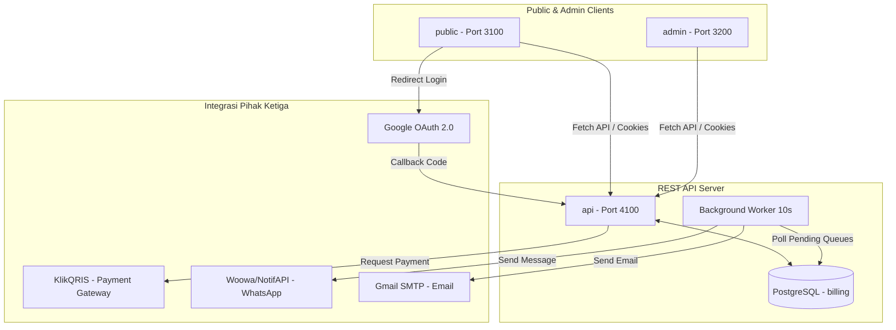

# Analisis Arsitektur & Kualitas Kode Project Nelofy

Dokumen ini berisi hasil analisis mendalam terhadap codebase project **Nelofy** yang mencakup aspek arsitektur, basis data, temuan bug kritis, celah keamanan, portabilitas, serta rekomendasi langkah perbaikan konkret.

---

## 1. Arsitektur Sistem & Aliran Data

Project **Nelofy** dibangun menggunakan arsitektur **3-tier terpisah** yang dikelola sebagai sub-direktori mandiri:



### Komponen Utama:
1. **`api/` (Backend)**:
   - Dijalankan menggunakan runtime **Bun** (`bun --watch app`) dengan framework **Express.js**.
   - Menghubungkan ke PostgreSQL menggunakan library `postgres-js`.
   - Menggunakan autentikasi berbasis token **JWT** yang disimpan dalam **HttpOnly Cookies**.
   - Menyediakan antrean background worker (`worker10s`) untuk memproses pengiriman email & WhatsApp secara asinkron.
2. **`public/` (Frontend Pengguna)**:
   - Dijalankan di port 3100. Express app yang merender template **EJS**.
   - Mengandalkan client-side JavaScript (`assets/javascript/`) yang cukup besar (vanilla JS) untuk manipulasi DOM dan fetch API.
3. **`admin/` (Panel Admin)**:
   - Dijalankan di port 3200. Express app yang merender template **EJS** untuk dashboard pengelolaan user dan order.

---

## 2. Inferred Database Schema (Skema Basis Data)

Berdasarkan query SQL di dalam folder `api/`, berikut adalah tabel-tabel utama yang digunakan beserta relasinya:

| Nama Tabel | Kolom Utama | Deskripsi |
| :--- | :--- | :--- |
| **`users`** | `id` (PK), `full_name`, `username`, `user_email`, `user_pass` (hashed), `user_phone`, `status`, `role` (`admin`/`user`), `reset_token`, `reset_token_expiry` | Data pengguna dan kredensial. |
| **`products`** | `id` (PK), `product_name`, `price`, `category`, `level` (tingkat), `product_image`, `description` | Informasi kelas/modul digital. |
| **`orders`** | `id` (PK), `order_id` (Invoice), `user_id` (FK), `product_id` (FK), `total_amount`, `status` (`PENDING`/`SUCCESS`/`EXPIRED`), `signature`, `qris_url`, `qris_image`, `expired_at`, `created_at` | Catatan transaksi pembelian produk. |
| **`vouchers`** | `id` (PK), `uniq_code`, `discount` (%), `expired` (timestamp) | Kupon diskon belanja. |
| **`queue`** | `id` (PK), `type` (`email`/`whatsapp`), `message`, `destination`, `status` (`pending`/`success`/`failed`), `subject` (khusus email) | Antrean pengiriman notifikasi (asinkron). |
| **`invoices`** | `id` (PK), `order_id` (FK), `no_invoice`, `jatuh_tempo`, `status`, `created_at` | Detail invoice (Catatan: tabel ini tidak pernah di-insert). |

---

## 3. Temuan Bug Kritis & Cacat Logika (Critical Bugs)

Kami menemukan beberapa kesalahan logika fatal di backend (`api/`) yang dapat menyebabkan malfungsi sistem di masa produksi:

### ⚠️ Bug 1: Pembaruan Massal Status Antrean (Queue Mass Update Bug)
Di dalam file [email_service.js](file:///c:/Users/Personal/OneDrive/Documents/project/Nelofy/api/modules/email/email_service.js#L44-L47) dan [whatsapp_services.js](file:///c:/Users/Personal/OneDrive/Documents/project/Nelofy/api/modules/whatsapp/whatsapp_services.js#L92), sistem memproses data satu per satu (`data_email[0]` / `rows[0]`), tetapi query update statusnya seperti ini:
```javascript
// Di email_service.js & whatsapp_services.js
await sql`
  UPDATE queue
  SET status = 'success'
  WHERE type = 'email' AND status = 'pending'`; // <-- ERROR LOGIKA!
```
> **Dampak**: Begitu satu pesan berhasil terkirim, **semua** antrean email atau WhatsApp berstatus `pending` di database akan langsung diubah statusnya menjadi `'success'`. Akibatnya, pesan ke-2, ke-3, dst. tidak akan pernah terkirim namun ditandai sukses.
> **Solusi**: Update status baris antrean secara spesifik menggunakan `id` pesan yang sedang diproses.

---

### ⚠️ Bug 2: Kunci Mati Pengiriman WhatsApp (WhatsApp Queue Lockout Bug)
Di file [whatsapp_services.js](file:///c:/Users/Personal/OneDrive/Documents/project/Nelofy/api/modules/whatsapp/whatsapp_services.js#L72-L82), terdapat pengecekan berikut:
```javascript
let rows2 = await sql`
    SELECT type,status
    FROM queue
    WHERE type = 'whatsapp'
    ORDER BY id DESC
    LIMIT 1`;

if (rows2[0].status == 'success') {
  return; // Berhenti jika pesan terbaru sukses
}
```
> **Dampak**: Jika baris antrean whatsapp terbaru (ID terbesar) berstatus `'success'`, background worker akan langsung `return` dan menolak memproses antrean lainnya. Apabila ada antrean lama berstatus `'pending'` di bawahnya, mereka akan **terkunci selamanya** dan tidak akan pernah terkirim. Selain itu, jika tabel `queue` kosong, query ini mengembalikan array kosong dan baris `rows2[0].status` akan melempar error *Runtime (Cannot read properties of undefined)*.

---

### ⚠️ Bug 3: Validasi Kedaluwarsa Instan pada Token Reset Password
Di file [reset_password_service.js](file:///c:/Users/Personal/OneDrive/Documents/project/Nelofy/api/modules/password/reset_password_service.js#L18-L33), fungsi `request_change_password` membuat token reset password, menyimpannya di DB dengan kedaluwarsa 3 menit ke depan, lalu **langsung** mengeceknya:
```javascript
// Di request_change_password
await sql`UPDATE users SET reset_token = ${token}, reset_token_expiry = NOW() + INTERVAL '3 minutes' ...`;
const expiryData = await sql`SELECT reset_token_expiry FROM users WHERE ...`;
const expiryDate = Date.parse(expiryData[0].reset_token_expiry);
const now = Date.now();

if (now > expiryDate) {
  // Langsung dihapus saat itu juga!
  await sql`UPDATE users SET reset_token = NULL, reset_token_expiry = NULL WHERE ...`;
  throw new Error('Token kedaluwarsa');
}
```
> **Dampak**: Jika terdapat perbedaan zona waktu (timezone mismatch) antara Node.js runtime (misalnya UTC) dengan server PostgreSQL (misalnya Local Time/WIB), kondisi `now > expiryDate` akan **langsung terpenuhi seketika token dibuat**. Akibatnya, token langsung dihapus di DB dan user akan selalu mendapatkan error "Token kedaluwarsa" saat meminta reset password. Pengecekan ini harusnya hanya dilakukan saat user men-submit token di endpoint `update_password`.

---

### ⚠️ Bug 4: Penggunaan Google Subject ID pada JWT Token (Auth Mismatch)
Di file [auth_controller.js](file:///c:/Users/Personal/OneDrive/Documents/project/Nelofy/api/modules/auth/auth_controller.js#L180-L191) bagian `callback_auth`:
```javascript
const check_user = await service.email_check(email);
// JWT ditandatangani menggunakan sub (Google User ID)
const token = jwt.sign({ id: payload.sub }, process.env.SECRET_KEY_JWT, { expiresIn: '1h' });
```
> **Dampak**: Saat token tersebut didekripsi di middleware autentikasi, `req.userId` diisi dengan `payload.sub` (berupa string ID Google yang panjang, contoh: `"11782390812739"`). Namun, database relasional Nelofy menggunakan integer auto-increment untuk `users.id` (misalnya `105`). Saat `req.userId` yang berisi string ID Google ini digunakan untuk query database seperti di `get_order_notification` atau transaksi:
> `WHERE o.pelanggan_id = ${userId}`
> Database akan mengalami **Type Mismatch Error** (integer vs varchar) atau mengembalikan data kosong. Seharusnya JWT diisi dengan `check_user.id`.

---

### ⚠️ Bug 5: Penggabungan Tabel `invoices` yang Tidak Ada Datanya
Di file [user_services.js](file:///c:/Users/Personal/OneDrive/Documents/project/Nelofy/api/modules/users/user_services.js#L35) dan [products_service.js](file:///c:/Users/Personal/OneDrive/Documents/project/Nelofy/api/modules/products/products_service.js#L32), sistem melakukan `JOIN` ke tabel `invoices`:
```sql
FROM public.orders o
JOIN public.invoices i ON o.id = i.order_id
```
> **Dampak**: Setelah diperiksa di seluruh codebase `api/`, **tidak ada satu pun fungsi yang melakukan `INSERT INTO invoices`**. Karena tabel `invoices` kosong, penggunaan `INNER JOIN` akan menyebabkan query transaksi selalu mengembalikan **0 baris**. Riwayat transaksi pengguna di halaman profil tidak akan pernah muncul.

---

### ⚠️ Bug 6: Potensi ReferenceError pada Worker Catch Block
Di file [worker.js](file:///c:/Users/Personal/OneDrive/Documents/project/Nelofy/api/common/worker.js#L13-L15) dan [auth_service.js](file:///c:/Users/Personal/OneDrive/Documents/project/Nelofy/api/modules/auth/auth_service.js#L280), terdapat variabel `data` atau `email_response` yang tidak dideklarasikan atau tidak di-import di file tersebut namun dipanggil di dalam block catch/fungsi:
```javascript
// Di worker.js
} catch (e) {
  console.log(e.stack);
  data.code = 500; // <-- data is not defined!
  data.status = 'failed';
}
```
> **Dampak**: Jika terjadi error di dalam block `try`, aplikasi akan crash total dengan pesan error `ReferenceError: data is not defined` alih-alih menangani error dengan aman.

---

## 4. Celah Keamanan (Security Vulnerabilities)

### 🔴 Eskalasi Hak Akses Admin (Privilege Escalation / Authorization Bypass)
Di file [admin_routes.js](file:///c:/Users/Personal/OneDrive/Documents/project/Nelofy/api/modules/admin/admin_routes.js), seluruh endpoint sensitif admin hanya dilindungi oleh middleware `verifyToken`:
```javascript
router.get('/user-data', verifyToken, get_all_user_data);
router.post('/add-user-data', verifyToken, add_user_data);
router.put('/user-data/:id', verifyToken, update_user_data);
router.delete('/user-data/:id', verifyToken, delete_user_data);
```
Sedangkan isi `verifyToken` hanya memeriksa apakah user memiliki token JWT yang valid.
> **Vulnerabilitas**: **Tidak ada pengecekan peran (`role = 'admin'`)**. Pengguna biasa dengan akun normal dapat melakukan request manual (misalnya lewat Postman/cURL) untuk membaca seluruh data user, memodifikasi user (termasuk mengubah password orang lain atau menaikkan role sendiri menjadi admin), serta menghapus user dan transaksi.
> **Solusi**: Tambahkan middleware pengecekan role `isAdmin` setelah `verifyToken`.

---

## 5. Portabilitas & Inkonsistensi Codebase

### ⚙️ Hardcoded ngrok Subdomains (OAuth & Client-Side Calls)
Callback Google OAuth diatur secara hardcode ke alamat ngrok tertentu di file frontend dan backend. Di antaranya:
- Di `auth_controller.js`: `'https://e10b-180-254-122-151.ngrok-free.app/callback_auth'`
- Di `products.ejs`: `href="https://e10b-180-254-122-151.ngrok-free.app/auth/google"`
- Di `home_page.ejs`: `href="https://e042-180-254-113-31.ngrok-free.app/auth/google"`
- Di `product.js` (frontend): `fetch('https://6c3f-180-254-113-31.ngrok-free.app/callback_auth?code=...')`

> **Masalah**: Setiap kali ngrok di-restart, URL ngrok akan berubah secara acak. Hardcoding ini membuat fitur Google Sign-In rusak dan membutuhkan pencarian manual di banyak file untuk mengganti URL-nya. Gunakan environment variable `BASE_API_URL` yang sudah ada di `.env` frontend dan backend.

### ⚙️ Inkonsistensi Syntax (ESM vs CommonJS)
Meskipun project ini dikonfigurasi sebagai ES Modules (terlihat dari `"type": "module"` atau format import di file utama backend), terdapat beberapa file controller dan route yang mencampurkan sintaks CommonJS seperti:
- Di `product_routes.js`: `const { verifyToken } = require('../../middleware/auth_middleware.js');`
- Di `products_controller.js`: `const service = require('./products_service')`
- Di `helper.js`: `const crypto = require('crypto');`

> **Masalah**: Bun dapat mentolerir campuran sintaks ini di satu file. Namun, jika project dipindahkan ke runtime Node.js standar atau di-build ke production bundle, aplikasi akan langsung melempar error sintaks dan gagal dijalankan.

---

## 6. Rekomendasi Langkah Perbaikan Konkret

### Langkah 1: Perbaiki Query Update Status Antrean
Di file [email_service.js](file:///c:/Users/Personal/OneDrive/Documents/project/Nelofy/api/modules/email/email_service.js) dan [whatsapp_services.js](file:///c:/Users/Personal/OneDrive/Documents/project/Nelofy/api/modules/whatsapp/whatsapp_services.js), ubah query SELECT agar menyertakan `id` antrean, kemudian gunakan `id` tersebut pada bagian `WHERE` saat mengupdate status menjadi `'success'`.

*Contoh Perbaikan di `email_service.js`:*
```javascript
// Ambil data queue beserta ID-nya
const data_email = await sql`
  SELECT id, message, destination, subject
  FROM queue
  WHERE type = 'email' AND status = 'pending'
  LIMIT 1`; // Ambil 1 per satu

if (data_email.length === 0) return;

// Proses kirim email ...
await send_email(data);

// Update HANYA baris yang sukses diproses
await sql`
  UPDATE queue
  SET status = 'success'
  WHERE id = ${data_email[0].id}`;
```

### Langkah 2: Tambahkan Middleware `isAdmin` untuk Keamanan Admin API
Buat middleware baru di `api/middleware/auth_middleware.js` untuk memverifikasi role pengguna:
```javascript
export const isAdmin = async (req, res, next) => {
  try {
    const user = await sql`SELECT role FROM users WHERE id = ${req.userId}`;
    if (user.count === 0 || user[0].role !== 'admin') {
      return res.status(403).json({ code: 403, message: 'Forbidden: Admin access required' });
    }
    next();
  } catch (error) {
    return res.status(500).json({ code: 500, message: error.message });
  }
};
```
Pasang middleware ini di rute admin setelah `verifyToken`:
```javascript
router.get('/user-data', verifyToken, isAdmin, get_all_user_data);
```

### Langkah 3: Gunakan Variable Environment untuk Callback URL
Ganti string ngrok yang hardcoded di backend dengan `process.env.URL_FRONTEND` dan tambahkan `/callback_auth` secara dinamis. Di frontend, gunakan variable global `baseUrl` yang diekstrak dari konfigurasi EJS.
